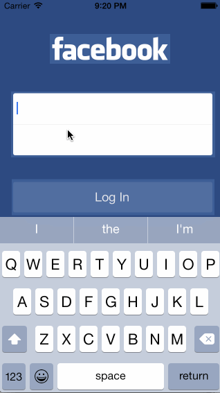

# Facebook Login
A facebook login system.

Total time spend: 4hrs

Features:
- type in email/password, the text field shift towards to the top when keyboard appears
- textField validation check
- shows AlertView when the email and password are incorrect or empty
- when textFields are filled, the Login button becomes available
- shows loading animation after clicking Login button
- on the feed screen, implemented UIRefresh animation when pulling down the content view 
- access the update status screen from the main feed screen
- Log out from the setting screen back to the Login screen

